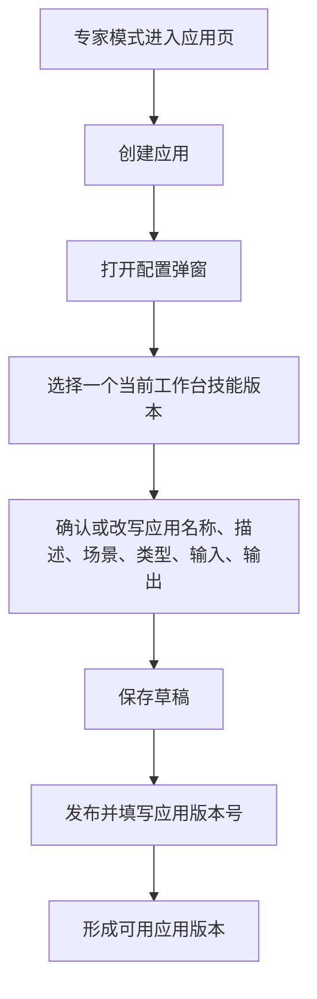
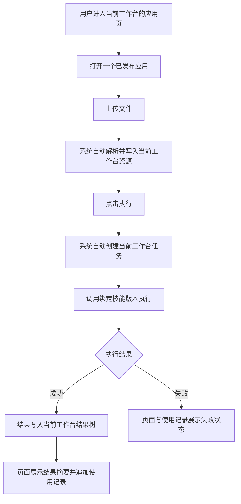

# 应用中心（技能应用）

**产品**：综合分析平台 / 应用中心  
**状态**：待设计  
**更新**：2026-06-29  
**关联材料**：审计工作台；`demo.html#freeaudit?projectId=PRJ-2026-001`；工作台新开对话空态引导优化；SkillHub 统一技能管理平台

---

## 1. 需求背景

当前工作台已经具备“资料 - 技能 - 任务 - 结果”的完整闭环，但对一线用户来说，仍然需要理解技能、对话、任务配置等概念，启动成本偏高。很多高频场景其实只需要“上传材料 -> 执行 -> 看结果”，不需要暴露完整专家操作链路。

本次应用中心用于把可复用的技能执行能力包装成面向业务用户的应用入口。首版只做“技能应用”，并继续复用当前工作台、任务和结果体系，不另起新的执行空间。

---

## 2. 目标场景

专家用户在当前工作台内，可以把一个已验证的技能版本通过弹窗配置成应用，再发布为可用版本。普通用户或轻量用户进入简单模式后，只围绕应用完成上传、执行、查看结果和查看使用记录，不接触技能配置、对话面板和任务列表。

---

## 3. 本次做什么

### 3.1 核心定义与边界

| 对象 | 口径 |
| --- | --- |
| 应用中心 | 工作台内的应用入口与应用管理页，承载应用列表、配置、发布和使用 |
| 技能应用 | 一个应用严格绑定一个技能版本、一套引导语、一套使用页配置 |
| 应用版本 | 发布时固化的应用快照，至少包含应用版本号、绑定技能版本、引导语和使用页配置 |
| 使用记录 | 当前工作台内某个应用的执行记录，关联上传资料、执行状态、结果和应用版本 |

说明：

1. 应用不是新的执行引擎，本质是“快捷创建任务”的业务封装。
2. 应用执行一律挂在当前工作台下：上传进入当前工作台资源，执行生成当前工作台任务，完成后结果进入当前工作台结果树。
3. 首版只支持技能应用，不支持多技能编排、第三方对接应用和自定义代码注入。

### 3.2 模式与导航

| 模式 | 左侧侧栏 | 内容区 | 右侧资源栏 |
| --- | --- | --- | --- |
| 专家模式 | 保留现有工作台导航，并在`技能`下方新增`应用`入口 | 点击`应用`后展示应用列表、配置弹窗和使用页 | 默认展开，保留材料、结果、数据库表、数据图谱、知识库 |
| 简单模式 | 仅展示`搜索`、`应用`、`设置`；Logo 下方增加`简单模式 / 专家模式`切换 | 默认进入应用中心；点击应用卡片进入具体使用页 | 默认展开，但只展示`材料`和`结果`，不展示数据库表、数据图谱、知识库 |

交互规则：

1. 两种模式共用同一个工作台外壳，不切换工作台上下文。
2. 简单模式不展示对话区、技能区、任务列表入口。
3. 简单模式中的`搜索`只搜索当前工作台下可用应用和本应用使用记录，不搜索对话、任务和技能。
4. 专家模式新增`应用`后，不改动现有`搜索`、`技能`、`对话 / 任务`等专家链路。

### 3.3 应用列表页

#### 3.3.1 专家模式列表

1. 页面标题为`应用`，右上角提供`创建应用`。
2. 页面固定展示两个范围：`我的应用`、`可用应用`。
3. 页面支持按关键字搜索，并按应用分类筛选。
4. 应用卡片至少展示：应用名称、应用描述、适用场景、绑定技能、当前版本、最近更新时间。

卡片动作：

| 范围 | 状态 | 可操作 |
| --- | --- | --- |
| `我的应用` | 草稿 | `编辑`、`发布` |
| `我的应用` | 已发布 | `使用`、`继续编辑` |
| `可用应用` | 已发布 | `使用` |

说明：

1. `继续编辑`表示基于当前已发布版本生成新的草稿，不直接改动已发布版本。
2. `可用应用`只展示已发布版本，不展示他人草稿。
3. 首版不在原型里强调“发布后全体可见可用”的提示文案，只保留发布动作和版本概念。

#### 3.3.2 简单模式列表

1. 简单模式进入`应用`后，只展示可用应用列表，不展示`创建应用`、`发布`、`编辑`。
2. 列表结构与专家模式应用卡片保持同源，但动作只保留`使用`。
3. 列表为空时展示轻量空态，提示先切回专家模式创建应用或等待已有应用发布。

### 3.4 应用配置弹窗

应用配置弹窗用于把技能包装成最终应用。首版配置项较少，不单独提供应用配置页。

| 区域 | 内容 | 规则 |
| --- | --- | --- |
| 选择技能 | 选择一个当前工作台技能及其固定版本 | 弹窗打开后优先完成技能选择；只能绑定一个技能版本 |
| 应用基本信息 | 应用名称、描述、场景、类型、输入、输出 | 默认继承所选技能的信息，允许应用侧改写；名称必填，用于列表展示 |
| 保存 / 发布 | 保存草稿或发布应用 | 未绑定技能版本时不能发布 |

交互规则：

1. 专家可在应用列表点击`创建应用`打开配置弹窗。
2. 专家可在当前工作台技能的更多菜单中点击`发布为应用`打开配置弹窗，并自动选中来源技能，继承技能名称、描述、场景、类型、输入、输出和版本信息。
3. 应用卡片中的`编辑`和`继续编辑`打开同一个配置弹窗。
4. 公共技能和技能市场中的技能不直接显示`发布为应用`；用户需先添加到当前工作台，再从当前工作台技能发布。
5. 未选择技能版本时，应用可以暂存草稿，但不能进入发布流程；未填写版本号时，不能执行发布。

### 3.5 轻发布管理

| 对象 | 规则 |
| --- | --- |
| 草稿 | 专家可持续编辑和保存，不对外使用 |
| 发布 | 点击`发布`时必须填写应用版本号，可附带更新说明 |
| 已发布版本 | 为不可直接修改的快照，用于最终使用 |
| 新一轮修改 | 基于已发布版本生成新草稿，再次发布形成新版本 |

说明：

1. 首版只要求有“草稿 / 已发布版本”的基本流转，不做复杂审批、权限细分和上下架策略。
2. 应用版本与技能版本都需要留痕，便于后续复盘某次执行使用的具体能力版本。
3. 原型中不需要额外展示“发布后全体可见可用”的说明文案。

### 3.6 应用使用页

应用使用页是最终面向业务用户的页面，默认围绕“上传、执行、查看结果、查看记录”展开。

| 区块 | 内容 | 规则 |
| --- | --- | --- |
| 页面头部 | 应用名称、版本、用途说明 | 让用户确认正在使用哪个应用版本 |
| 上传区 | 上传文件、替换文件、删除文件、解析状态 | 上传后文件自动进入当前工作台资源 |
| 执行区 | `执行`按钮、执行提示、运行状态 | 仅在必需输入齐备后可执行 |
| 结果区 | 结果摘要、查看结果入口 | 任务完成后自动展示最新结果摘要，并可打开结果详情 |
| 使用记录 | 当前工作台内本应用的历史执行记录 | 简单模式下以此替代独立任务列表 |

交互规则：

1. 用户点击`执行`后，系统自动完成文件解析、创建任务、调用绑定技能和写入结果，不再让用户手动配任务。
2. 执行过程中，页面需要明确区分`待上传`、`可执行`、`执行中`、`成功`、`失败`。
3. 执行成功后，结果自动沉淀到当前工作台结果树，并在当前页面展示结果摘要与`查看结果`入口。
4. 执行失败时，在当前页面和使用记录中展示失败状态，并允许用户重新进入上传 / 执行链路。
5. 使用记录至少展示：执行时间、应用版本、上传材料数量、执行状态、结果入口。
6. 简单模式不单独展示任务列表，但用户仍可通过使用记录理解执行进度和结果去向。

### 3.7 业务流程

#### 3.7.1 专家配置并发布技能应用

#### 3.7.2 用户在当前工作台使用应用

---

## 4. 本次不做什么

1. 不做多技能串联、条件分支、工作流编排式应用。
2. 不做第三方连接器应用、外部系统动作和自定义代码注入。
3. 不做独立应用配置页、实时预览、试跑区和自由拖拽式低代码画布。
4. 不做简单模式下的独立任务列表、对话区、技能区和数据库 / 图谱 / 知识库入口。
5. 不做复杂审批、角色权限细分、租户级可见范围和运营统计。
6. 不改变当前工作台作为执行上下文的基础规则，不新增临时工作台或独立应用运行空间。

---

## 5. 验收口径

1. 专家模式左侧侧栏在`技能`下方新增`应用`入口，点击后在内容区打开应用模块。
2. Logo 下方可以切换`简单模式 / 专家模式`；简单模式侧栏只展示`搜索`、`应用`、`设置`。
3. 两种模式下右侧资源栏默认展开；简单模式只展示`材料`和`结果`，不展示数据库表、数据图谱、知识库。
4. 专家模式可以通过`创建应用`打开配置弹窗，并且一个应用只能绑定一个技能版本。
5. 当前工作台技能的更多菜单中可以点击`发布为应用`打开配置弹窗；公共技能和技能市场不直接显示该动作。
6. 应用卡片中的`编辑`和`继续编辑`应打开同一个配置弹窗，不进入独立配置页。
7. 未绑定技能版本时不能发布；未填写应用版本号时不能发布。
8. 简单模式或专家模式用户打开已发布应用后，可以完成上传、执行、查看结果的完整链路。
9. 用户点击执行后，系统会在当前工作台内自动解析文件、创建任务并执行，不再要求手动进入任务配置。
10. 执行成功后，结果会自动写入当前工作台结果树，并在应用使用页展示结果摘要和查看入口。
11. 简单模式不展示独立任务列表，但应用使用页必须展示当前工作台内该应用的使用记录。
12. 使用记录能够区分至少`执行中`、`成功`、`失败`状态，并能体现对应应用版本和结果入口。
