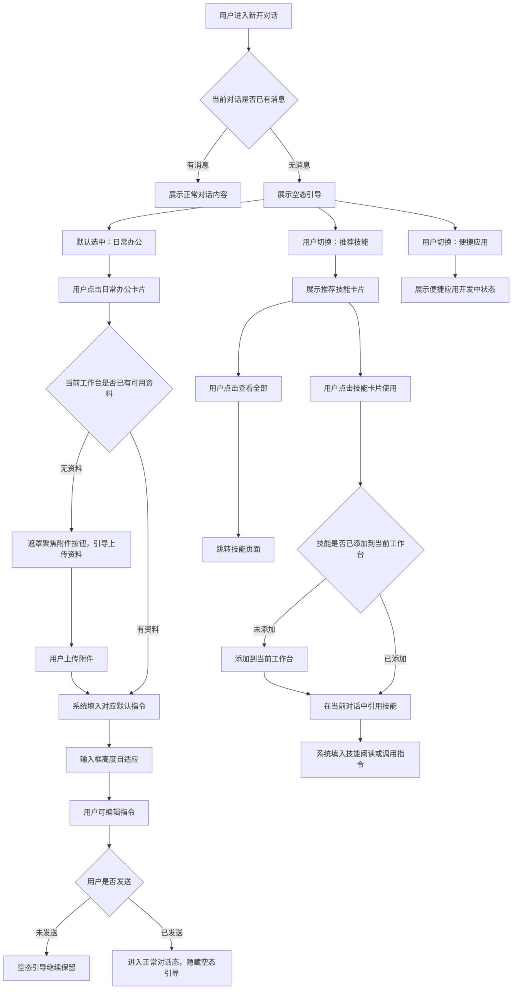

# 工作台新开对话空态引导优化

**产品**：综合分析平台 / 审计工作台  
**状态**：待开发  
**更新**：2026-06-16  
**关联材料**：审计工作台新开对话页；对话区空态引导原型；技能页面；对话输入框附件上传

---

## 1. 需求背景

审计工作台新建后大概率是空工作台，用户既没有上传资料，也不清楚平台能做什么。大量一线审计人员仍习惯传统点按式操作，如果对话区只展示空输入框，会不知道下一步该上传材料、调用技能，还是直接提问。

本次优化是在“新开对话 / 无消息”时，为对话区域提供轻量空态引导：既让用户理解可选择的工作方式，也通过少量场景卡片帮助用户快速开始。该需求只优化对话区空态，不重构工作台整体结构。

---

## 2. 目标场景

用户进入新工作台或新建对话后，可以通过空态引导选择“日常办公 / 推荐技能 / 便捷应用”三类入口；点击具体卡片后，系统根据当前是否已有资料，决定是先引导上传附件，还是直接生成可编辑指令。

---

## 3. 本次做什么

### 3.1 空态基础结构

空态展示条件：

| 场景 | 展示规则 |
| --- | --- |
| 新开对话且暂无消息 | 展示空态引导 |
| 已有对话消息 | 不展示空态引导 |
| 用户点击卡片后仅生成输入内容、尚未发送 | 空态引导仍保留 |
| 用户发送第一条消息后 | 进入正常对话态，不再展示空态引导 |

空态内容包括：

1. 保留现有 logo 和标题：`你好，我能帮你做什么？`
2. 标题下方展示模式切换：`日常办公 / 推荐技能 / 便捷应用`
3. 默认选中“日常办公”
4. 模式切换只影响空态下方内容，不影响工作台主视图、侧栏或右侧工具栏

### 3.2 日常办公卡片

日常办公用于服务一线审计人员的高频办公场景。首期预置 6 个指令卡片，每次展示 3 个，支持“换一批”。

| 卡片 | 描述口径 | 指令方向 |
| --- | --- | --- |
| 修改材料 | 统一金额日期格式，检查前后对应 | 检查金额、日期、引用文件、同类表述、前后对应、公文格式，并给出修改稿 |
| 信息汇总 | 从多份材料提取信息，填入明细表 | 从材料中提取收款人、事项、金额等关键信息并汇总 |
| 数据分析 | 按表格字段统计，筛查异常疑点 | 基于表格字段做统计分析，必要时生成分析口径或 SQL |
| 取证单初稿 | 围绕审计事项生成取证单 | 生成包含项目名称、被审计单位、审计事项、资料来源、问题定性等结构的初稿 |
| 工作底稿初稿 | 生成审计工作底稿初稿 | 生成包含核查过程、资料来源、问题定性、定性依据等结构的初稿 |
| 审计报告初稿 | 生成报告四部分框架初稿 | 生成基本情况、审计评价、审计发现问题、审计建议四部分内容 |

卡片规则：

1. 卡片包含标题、两行以内描述、标签和“使用”动作。
2. 标签用于说明场景类型，例如材料修改、格式校验、信息抽取、表格统计、疑点筛查、取证单、工作底稿、审计报告。
3. 点击卡片后不自动发送消息，只生成可编辑指令。
4. 指令默认假定用户已经准备相关材料，但允许用户自行修改。
5. 如果当前工作台没有任何资料，先引导用户点击附件按钮上传材料；上传后再自动填入指令。
6. 如果当前已有资料，直接将指令填入输入框并聚焦。
7. 指令填入后必须触发输入框高度自适应。

### 3.3 推荐技能卡片

推荐技能用于承接技能市场和共享技能能力。首期按热门技能逻辑展示，排序依据优先使用下载次数或安装次数。

卡片规则：

1. 默认展示 3 个热门技能。
2. 技能卡片包含技能名称、描述、标签和“使用”动作。
3. 描述最多展示 2 行；无描述时不展示占位废文案，并保持卡片结构稳定。
4. 标签与技能已有维度一致，例如审计场景、类型、目的、阶段等。
5. 标签过多时只展示有限数量，并用数量提示表达还有更多标签。
6. “换一批”在热门技能列表中切换下一组，不改变排序口径。
7. “查看全部”直接跳转到技能页面。
8. 点击技能卡片“使用”后，等同于将该技能添加到当前工作台，并在当前对话中引用该技能；如果该技能已在当前工作台中，则直接引用。
9. 引用技能后，在输入框生成阅读或调用该技能的指令，要求系统先说明适用场景、需要材料、产出结果，并判断当前资料是否足以执行。

### 3.4 换一批逻辑与范围

“换一批”只在当前页签内切换卡片，不跨页签、不改变排序口径、不触发实际执行。

| 页签 | 候选范围 | 切换规则 |
| --- | --- | --- |
| 日常办公 | 本需求预置的 6 个日常办公指令卡片 | 每次展示 3 个，点击“换一批”切换到下一组；到达末尾后回到第一组 |
| 推荐技能 | 当前用户有权限查看、且可添加到当前工作台的热门技能 | 按下载次数或安装次数倒序取候选列表，每次展示 3 个，点击“换一批”展示下一组；到达末尾后回到第一组 |
| 便捷应用 | 当前不提供应用卡片 | 不展示“换一批” |

说明：

1. 日常办公的“换一批”不包含用户自定义指令、技能卡片或应用卡片。
2. 推荐技能的“换一批”不做随机推荐，不根据点击临时打乱顺序。
3. 推荐技能候选不足 4 个时，不展示“换一批”。
4. 推荐技能列表数据变化后，下一次进入空态时按最新热度重新生成候选顺序。

### 3.5 便捷应用

便捷应用用于承接未来应用模块。当前模块未完成时，只展示开发中状态，不展示虚假的工具列表。

后续应用上线后，可复用推荐技能的轻卡片结构，但动作应是打开或使用应用，而不是生成技能指令。

### 3.6 无资料引导

当用户点击需要资料支撑的卡片，且当前工作台没有资料时：

1. 系统通过遮罩聚焦输入框附件按钮。
2. 遮罩只突出上传入口，不使用复杂弹窗说明。
3. 用户上传附件后，系统自动填入刚才选择卡片对应的指令。
4. 遮罩提供“不再提醒”入口。
5. “不再提醒”只记录在浏览器缓存中，不做账号级或服务端记忆。

### 3.7 交互流程

### 3.8 卡片默认指令说明

通用规则：

1. 卡片点击后只填入输入框，不自动发送。
2. 指令应假定用户已经准备相关材料，但允许用户自行修改。
3. 如果当前工作台没有资料，应先引导上传附件，上传后再自动填入指令。
4. 指令填入后应触发输入框高度自适应。
5. 指令文本应尽量像审计人员真实会说的话，不使用大量占位符格式。

日常办公卡片默认指令：

| 卡片 | 默认填入指令 |
| --- | --- |
| 修改材料 | 请基于我已经准备好的相关审计材料，帮我对材料文字进行修改完善。请重点检查金额、日期、引用文件等格式是否统一，同类对象表述是否一致，标题与内容、问题与建议、事实与依据之间是否前后对应，并检查是否符合正式审计材料或公文写作要求。请在不改变原有事实、数据和审计结论的前提下，使表述更清晰、逻辑更顺畅、语气更正式稳妥，并输出一版可直接使用的修改稿；如发现依据不足或需要我补充确认的内容，请单独列出。 |
| 信息汇总 | 请基于我已经准备好的相关审计材料和明细表，帮我提取并汇总关键信息。请先识别材料中的收款人、付款单位、事项、金额、日期、合同或发票编号、审批流程等字段，再按照明细表字段进行整理填充。对于无法从材料中确认的信息，请不要自行推断，统一标注为“待核实”，并在最后列出需要我补充或确认的内容。 |
| 数据分析 | 请基于我已经准备好的表格数据，帮我围绕审计目标开展统计分析和异常筛查。请先理解表格字段含义，再根据金额、时间、对象、事项、科目、项目等维度进行汇总、排序、交叉比对和异常识别。请输出分析口径、关键统计结果、可能存在的疑点及建议进一步核查的数据范围；如需要使用 SQL 或筛选条件，请一并给出。 |
| 取证单初稿 | 请基于我已经准备好的相关资料，根据审计取证单的格式要求，帮我生成一份审计取证单初稿。请先判断现有资料是否足以支撑取证单内容，如资料不足，请先说明需要补充或核实的信息。若资料基本充分，请围绕给定问题或资料中已经能够支撑的事实起草，结构上包含项目名称、被审计单位、审计事项、资料来源、问题定性、主要内容、定性依据。表述要正式、稳妥，包含日期、金额等关键信息，避免超出资料证据范围作确定性结论。 |
| 工作底稿初稿 | 请基于我已经准备好的相关资料，根据审计工作底稿的格式要求，帮我生成一份审计工作底稿初稿。请先判断我需要生成的是普通审计工作底稿，还是经济责任审计工作底稿；如果无法判断，请先向我确认。确认后，请围绕资料起草，结构上包含项目名称、被审计单位、审计事项、核查过程、资料来源、问题定性、主要内容、定性依据、被审计单位意见及审计组采纳情况。表述要正式、稳妥，包含日期、金额等关键信息，避免超出资料证据范围作确定性结论。 |
| 审计报告初稿 | 请基于我已经准备好的相关资料，根据审计报告的格式要求，帮我生成一份审计报告初稿。请先判断现有资料是否足以形成完整报告，如资料不足，请先输出一版可继续补充的框架稿，并在文末列出还需要补充或核实的信息。报告结构请围绕基本情况、审计评价、审计发现问题、审计建议四部分展开。表述要正式、稳妥，包含日期、金额等关键信息，避免超出资料证据范围作确定性结论。 |

推荐技能卡片默认指令：

> /【技能名称】，阅读这个技能。  
> 请先从适用场景、需要材料、产出结果三个方面介绍这个技能适合解决什么问题，并判断当前工作台已有资料是否足以执行。  
> 如果资料不足，请列出需要补充的材料和建议上传顺序；如果资料已满足，请说明执行前需要我确认的事项，并给出下一步操作建议。

便捷应用当前不生成具体执行指令。后续应用上线后，卡片动作应优先是“打开应用”或“使用应用”，不默认生成长文本指令。

---

## 4. 本次不做什么

1. 不重构工作台整体页面。
2. 不新增完整新手任务流或复杂弹窗 Tour。
3. 不实现真实资料识别推荐算法。
4. 不要求推荐技能本期实现个性化推荐。
5. 不展示未上线的便捷应用能力。
6. 不把下载次数、安装次数强制展示在卡片上；热度仅作为排序依据。
7. 不把原型里的具体尺寸、颜色、hover 效果写成产品规则。

---

## 5. 验收口径

1. 用户进入新开对话且暂无消息时，可以看到标题、三类模式切换和默认日常办公卡片。
2. 用户切换“日常办公 / 推荐技能 / 便捷应用”后，下方内容正确切换。
3. 日常办公支持 6 个预置卡片，每次展示 3 个，并可通过“换一批”切换。
4. 用户点击日常办公卡片且当前无资料时，系统先引导上传附件，上传后自动填入对应指令。
5. 用户点击日常办公卡片且当前已有资料时，系统直接填入对应指令并聚焦输入框。
6. 指令填入输入框后，输入框高度能随内容自适应。
7. 推荐技能默认展示 3 个热门技能，支持“换一批”和“查看全部”。
8. 推荐技能卡片能兼容描述过长、无描述、标签过多等情况。
9. 用户点击“查看全部”后进入技能页面。
10. 用户点击推荐技能卡片“使用”后，未添加技能应先添加到当前工作台，再在当前对话中引用该技能并填入阅读或调用指令；已添加技能应直接引用并填入指令。
11. 日常办公“换一批”只在 6 个预置日常卡片内按每组 3 个循环切换。
12. 推荐技能“换一批”只在当前用户可见且可添加到当前工作台的热门技能候选内切换；候选不足 4 个时不展示“换一批”。
13. 便捷应用未上线时，只展示开发中状态，不提供不可执行入口。
14. 用户生成输入内容但未发送时，空态引导仍保留；发送第一条消息后，空态引导消失。
