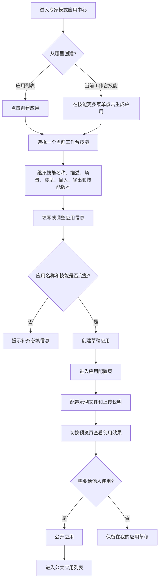
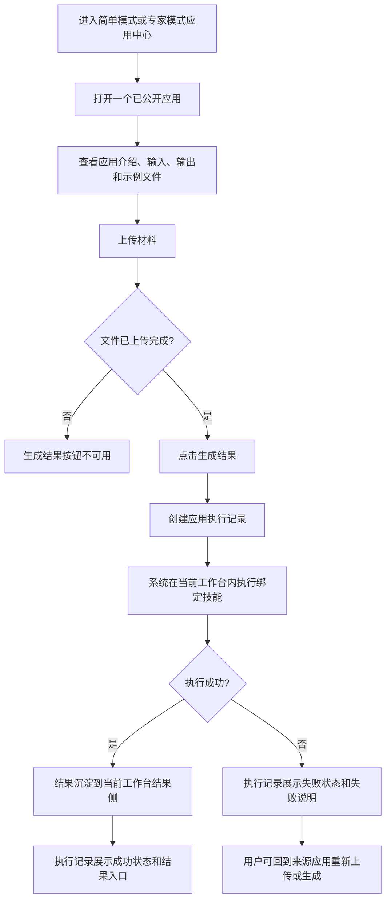

# 应用中心（技能应用）

**产品**：综合分析平台 / 应用中心  
**状态**：待开发  
**更新**：2026-07-02  
**关联材料**：`demo.html#freeaudit?projectId=PRJ-2026-001`；`综合分析平台 20260630/js/freeaudit/demo-cmp-freeaudit-v2.js`；应用流程一致性审查；应用配置页与预览页审查

---

## 1. 需求背景

当前工作台已经具备资料、技能、任务和结果闭环，但专家链路对普通业务用户仍然偏重：用户需要理解技能、任务配置和对话协作，才能完成一次高频分析。

应用中心将当前工作台内已验证的技能包装成可直接使用的应用。普通用户在简单模式下围绕应用完成上传、生成和查看结果；专家用户在专家模式下负责创建、配置、公开和维护应用。应用不另起执行空间，仍复用当前工作台的资料、任务和结果体系。

---

## 2. 目标场景

普通用户进入工作台后，可以在应用中心找到公共应用或收藏应用，按应用说明上传材料并生成结果；生成后可以通过应用内执行记录或左侧任务入口追踪状态、查看结果和下载产物。

专家用户可以从当前工作台技能生成应用，补充应用信息、示例文件和上传说明，预览最终使用页效果，并将应用公开给其他用户使用。

---

## 3. 本次做什么

### 3.1 应用对象与状态

| 对象 | 规则 |
| --- | --- |
| 应用 | 首版为技能应用，绑定一个当前工作台技能和一个技能版本 |
| 应用信息 | 包含名称、描述、适用场景、应用类型、输入、输出、创建人、所属组织 |
| 使用页配置 | 包含上传提示、上传文件示例、结果输出示例 |
| 草稿应用 | 仅创建人可在“我的应用”中维护，不进入公共应用列表 |
| 公开应用 | 出现在“公共应用”列表，可被其他用户进入和使用 |
| 执行记录 | 记录一次应用生成过程，关联来源应用、上传材料、状态和产出结果 |

说明：

1. 应用执行仍挂在当前工作台下，上传材料、执行任务和产出结果都进入当前工作台上下文。
2. “公开 / 取消公开”是首版的轻发布动作，不单独要求用户填写应用版本号。
3. 编辑已有应用时不重新绑定技能，只维护应用信息和使用页配置。

### 3.2 模式与导航

| 模式 | 侧栏与入口 | 应用中心定位 |
| --- | --- | --- |
| 简单模式 | 默认进入应用；保留搜索、应用和设置入口 | 面向使用，支持收藏应用、进入应用、查看应用任务 |
| 专家模式 | 保留对话、任务、技能、应用等工作台入口 | 面向生产和管理，支持创建、配置、公开、取消公开和删除自建应用 |

交互规则：

1. 两种模式共用同一个工作台外壳和工作台上下文。
2. 用户在应用页切换简单 / 专家模式时，应尽量保留当前应用上下文；从配置页切到简单模式时进入该应用使用页。
3. 简单模式不暴露技能配置、对话和任务创建链路；专家模式不影响原有对话、技能和任务链路。

### 3.3 应用列表

应用中心列表包含`公共应用`和`我的应用`两个范围，并支持搜索、适用场景筛选、应用类型切换和排序。

| 范围 | 展示口径 | 可操作 |
| --- | --- | --- |
| 公共应用 | 已公开且非本人创建的应用 | 进入、收藏 |
| 我的应用 | 本人创建的草稿或公开应用 | 进入、编辑、公开 / 取消公开、删除 |

应用卡片展示应用名称、描述、适用场景、输入、输出、创建人、组织和收藏 / 使用次数。自建且已公开的应用需要有明确“已公开”标识。

### 3.4 创建与编辑

1. 专家模式应用列表提供`创建应用`入口。
2. 当前工作台技能卡片更多菜单提供`生成应用`入口；公共技能和技能市场中的技能需要先添加到当前工作台，再生成应用。
3. 创建弹窗必须填写应用名称，并选择一个当前工作台技能。
4. 选择技能后，默认继承技能名称、描述、适用场景、技能类型、输入、输出和技能版本。
5. `更多信息设置`中可调整应用描述、适用场景、应用类型、输入和输出。
6. 创建成功后形成草稿，并进入应用配置页；编辑已有应用打开同一个弹窗保存基础信息。

### 3.5 配置与预览

应用配置页用于维护最终使用页内容，不再采用单纯配置弹窗承载全部配置。

| 区域 | 内容 | 规则 |
| --- | --- | --- |
| 应用摘要 | 名称、标签、描述、输入、输出 | 可通过编辑弹窗维护基础信息 |
| 示例文件 | 上传文件示例、结果输出示例 | 支持添加、移除和预览 |
| 上传说明 | 使用页顶部上传提示 | 支持编辑并自动保存 |
| 预览页 | 按使用页样式展示配置效果 | 预览态不可上传或生成结果 |

说明：

1. 从配置页切换到预览页前，应保存当前配置。
2. 示例文件预览用于帮助配置者确认上传材料和输出结果的展示效果。
3. 预览页只验证配置映射和使用页效果，不作为完整可执行沙箱。

### 3.6 应用使用与执行记录

| 区块 | 内容 | 规则 |
| --- | --- | --- |
| 应用介绍 | 名称、场景、类型、描述、输入、输出、示例文件 | 用户进入应用后先确认用途和材料要求 |
| 上传区 | 拖拽 / 选择文件、继续上传、删除文件、上传状态 | 无文件或文件上传中时不能生成结果 |
| 上传规则 | 支持格式、ZIP、单批 4GB 上限 | 平台固定规则，不由应用单独配置 |
| 生成 | `生成结果`按钮和生成状态 | 点击后创建一条应用执行记录 |
| 生成记录 | 当前应用的执行记录 | 展示上传材料数、产出结果数、状态和结果入口 |
| 记录详情 | 来源应用、任务过程、使用技能、上传材料、产出结果 | 简单模式突出结果阅读；专家模式可查看任务过程和右侧详情 |

执行状态至少覆盖`待上传`、`上传中`、`进行中`、`成功`、`失败`。执行成功后，结果应沉淀到当前工作台结果侧；执行失败时，记录详情展示失败说明，并允许用户回到来源应用重新执行。

### 3.7 Mermaid 流程图

#### 3.7.1 专家创建、配置并公开应用

#### 3.7.2 用户使用应用并查看执行记录

---

## 4. 本次不做什么

1. 不做多技能串联、条件分支、工作流编排式应用。
2. 不做第三方连接器应用、外部系统动作和自定义代码注入。
3. 不做复杂审批、角色权限细分、租户级可见范围和运营统计。
4. 不做独立于工作台之外的应用运行空间。
5. 不做完整低代码画布，也不把预览页做成可真实执行的沙箱。
6. 不新增单独的应用版本号填写流程；首版以草稿、公开和取消公开支撑轻量生命周期。

---

## 5. 验收口径

1. 进入工作台后，左侧侧栏可以看到`应用`入口；简单模式默认进入应用中心。
2. `简单模式 / 专家模式`切换后仍保持当前工作台上下文；在应用页切换模式不丢失当前应用。
3. 应用列表可以在`公共应用`和`我的应用`之间切换，并支持搜索、场景筛选、类型切换和排序。
4. 公共应用只展示已公开应用；我的应用展示本人草稿和已公开应用。
5. 专家模式可以从应用列表创建应用，也可以从当前工作台技能的更多菜单点击`生成应用`。
6. 创建应用时，未填写应用名称或未选择当前工作台技能时不能创建。
7. 选择技能后，应用默认继承技能名称、描述、适用场景、类型、输入、输出和技能版本。
8. 创建成功后进入配置页，配置页可以维护示例文件和上传说明，并能切换到预览页查看使用页效果。
9. 预览页不可上传或生成结果，但应展示应用介绍、输入、输出、示例文件和上传说明。
10. 用户进入应用使用页后，上传文件完成前`生成结果`不可用；上传完成后可以点击生成。
11. 点击生成后，系统新增一条应用执行记录，并能在应用内生成记录和左侧任务入口看到该记录。
12. 执行记录至少能展示`进行中`、`成功`、`失败`状态，以及来源应用、上传材料、产出结果和结果入口。
13. 专家模式自建应用支持编辑、公开 / 取消公开、删除；简单模式应用更多菜单只提供收藏相关操作。
