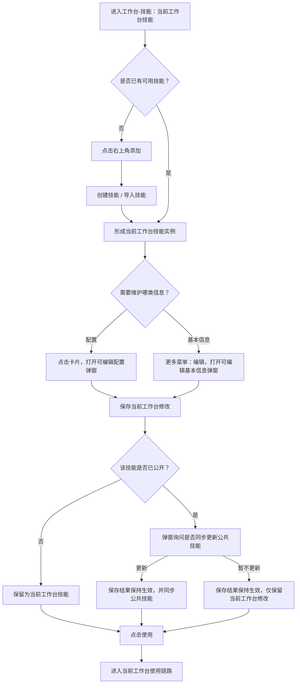
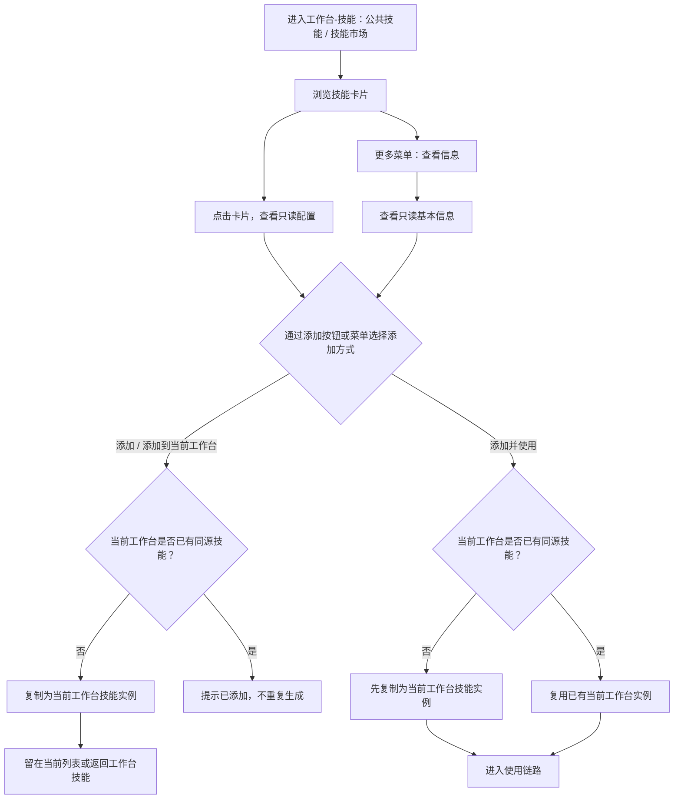
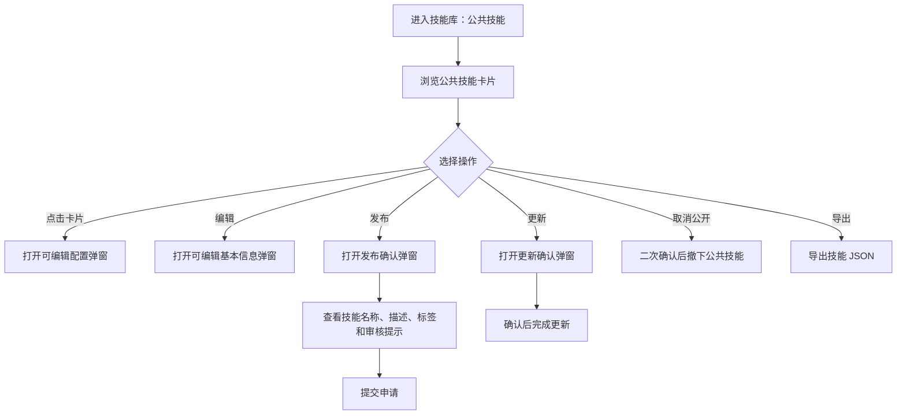
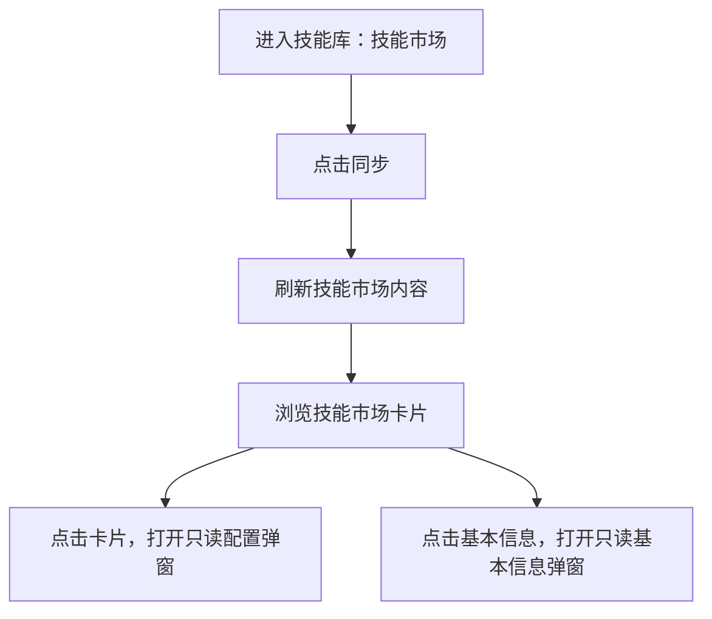

# 技能板块（技能库与工作台）

**产品**：综合分析平台  
**状态**：待开发  
**更新**：2026-06-17  
**关联材料**：`demo.html#freeaudit?projectId=PRJ-2026-001`；`demo.html#template`；技能配置弹窗；技能基本信息弹窗

---

## 1. 需求背景

当前原型中的技能能力已经收口为两块：`工作台-技能`负责当前工作台内技能的引入、维护和使用，`技能库`负责平台公共技能管理与技能市场内容同步。

本卡用于记录当前原型里已经形成的页面结构、入口、动作和弹窗关系，作为后续设计对齐、开发实现和联调验收的依据，不再描述早期“我的技能 / 共享技能 / 组织技能库”那套历史方案。

---

## 2. 目标场景

用户在工作台中可以围绕当前审计任务完成技能的创建、导入、添加、配置和使用；用户进入技能库后，可以管理公共技能，并浏览同步后的技能市场内容。两块页面分别承载“工作台内使用”和“平台侧管理”两类场景。

---

## 3. 本次做什么

### 3.1 页面分工

| 页面 | 页签 / 范围 | 当前定位 | 当前主动作 |
| --- | --- | --- | --- |
| 工作台-技能 | 当前工作台技能 / 公共技能 / 技能市场 | 围绕当前工作台使用和维护技能 | 创建、导入、添加、使用 |
| 技能库 | 公共技能 / 技能市场 | 管理平台公共技能，浏览并同步技能市场 | 发布、编辑、取消公开、更新、导出、同步 |

说明：

1. 工作台与技能库是两套入口，职责不同。
2. 工作台承载技能消费与工作台内维护；技能库承载平台管理。
3. 当前技能库页面内不提供创建、添加、使用入口。

### 3.2 工作台-技能页面

#### 3.2.1 顶部结构

1. 页面标题为`技能`，副标题为“通过技能为大模型注入审计思路”。
2. 页签固定为：`当前工作台技能`、`公共技能`、`技能市场`。
3. 无论当前位于哪个页签，右上角都显示`添加`按钮。
4. `添加`按钮点击后展开常规菜单，菜单项为：`创建技能`、`导入技能`。
5. 页面支持搜索、按审计场景筛选、按技能类型切换、按时间或添加次数排序。

#### 3.2.2 当前工作台技能

卡片展示内容：

| 区域 | 当前内容 |
| --- | --- |
| 标题区 | 技能名称、审计场景标签、技能类型标签 |
| 状态角标 | 已公开技能显示`已公开` |
| 内容区 | 技能描述、输入、输出 |
| 底部信息 | 创建人、所属组织、更新时间 |
| 右下角主按钮 | `使用` |
| 更多菜单 | `编辑`、`公开/取消公开`、`更新`、`导出`、`删除` |

交互规则：

1. 点击卡片默认打开`配置弹窗`，可编辑。
2. 点击更多菜单中的`编辑`，打开`基本信息弹窗`，可编辑。
3. `公开/取消公开`用于控制该工作台技能是否进入公共技能。
4. `更新`仅对已公开技能显示，点击后先弹确认弹窗；用户确认后，将当前工作台版本同步到公共技能。
5. `导出`导出当前技能 JSON。
6. `删除`删除当前工作台中的该技能。
7. 点击`使用`后，将该技能带入当前对话使用链路。
8. 当用户在`基本信息弹窗`或`配置弹窗`中保存已公开技能后，系统先保存当前工作台修改，再弹出“是否更新公共技能”的确认弹窗；无论用户选择`更新`还是`暂不更新`，当前工作台保存结果都保持生效，只有确认更新时才同步公共技能。

#### 3.2.3 公共技能与技能市场

两类页签在工作台中的卡片结构一致，区别只在数据来源。

| 区域 | 当前内容 |
| --- | --- |
| 标题区 | 技能名称、审计场景标签、技能类型标签、`xx次添加` |
| 内容区 | 技能描述、输入、输出 |
| 底部信息 | 创建人、所属组织、更新时间 |
| 右下角操作 | 单个`添加`按钮，按钮内包含下拉入口 |
| 添加菜单 | `添加到当前工作台`、`添加并使用` |
| 更多菜单 | `查看信息` |

交互规则：

1. 点击卡片默认打开`配置弹窗`，只读。
2. 点击更多菜单中的`查看信息`，打开`基本信息弹窗`，只读。
3. 点击`添加`按钮本身或菜单中的`添加到当前工作台`后，在当前工作台生成一条技能实例。
4. 同一来源技能在同一工作台内已存在时，再次添加只提示“已添加到当前工作台”，不重复生成。
5. 点击`添加并使用`时，若当前工作台尚未添加该技能，则先添加；随后直接以当前工作台中的技能实例进入使用链路。
6. `公共技能`与`技能市场`两个页签下，卡片底部信息均统一展示为：创建人、所属组织、更新时间。

### 3.3 技能库页面

#### 3.3.1 顶部结构

1. 页面标题为`技能库`。
2. 页签固定为：`公共技能`、`技能市场`。
3. 公共技能页右上角显示`类型管理`。
4. 技能市场页右上角显示`同步`。
5. 页面支持搜索、按业务场景筛选、按技能类型切换、按更新时间排序。

#### 3.3.2 公共技能

卡片展示内容：

| 区域 | 当前内容 |
| --- | --- |
| 标题区 | 技能名称、审计场景标签、技能类型标签、`xx次添加` |
| 内容区 | 技能描述、输入、输出 |
| 底部信息 | 创建人、所属组织、更新时间 |
| 右下角主按钮 | `发布` |
| 更多菜单 | `编辑`、`取消公开`、`更新`、`导出` |

交互规则：

1. 点击卡片默认打开`配置弹窗`，可编辑。
2. 点击更多菜单中的`编辑`，打开`基本信息弹窗`，可编辑。
3. 点击`发布`时，打开发布确认弹窗；弹窗内展示技能名称、技能描述、标签，并在底部展示审核提示；用户点击`提交申请`后完成发布申请。
4. 点击`更新`时，直接打开确认弹窗；用户确认后，以当前公共技能最新内容完成更新。
5. 点击`取消公开`时，二次确认后将该技能从公共技能列表撤下。
6. 点击`导出`时，导出该技能 JSON。
7. 公共技能不单独提供`删除`动作；`取消公开`即表示从公共技能列表移除。

#### 3.3.3 技能市场

卡片展示内容：

| 区域 | 当前内容 |
| --- | --- |
| 标题区 | 技能名称、审计场景标签、技能类型标签、`xx次添加` |
| 内容区 | 技能描述、输入、输出 |
| 底部信息 | 创建人、所属组织、更新时间 |
| 右下角按钮 | `基本信息` |

交互规则：

1. 点击卡片默认打开`配置弹窗`，只读。
2. 点击`基本信息`时，打开`基本信息弹窗`，只读。
3. 技能市场卡片不显示更多按钮。
4. 技能市场页仅保留页面级`同步`动作，不在卡片上提供添加、使用、发布或入库动作。

### 3.4 弹窗关系

1. `基本信息弹窗`与`配置弹窗`为两套独立弹窗。
2. `点击卡片`默认进入配置。
3. `编辑 / 查看信息 / 基本信息`进入基本信息弹窗。
4. 基本信息弹窗中只有`技能名称`为必填项。
5. 工作台中的工作台技能：基本信息与配置均可编辑。
6. 工作台中的公共技能、技能市场：基本信息与配置均只读。
7. 技能库中的公共技能：基本信息与配置均可编辑。
8. 技能库中的技能市场：基本信息与配置均只读。
9. 技能库中的`发布`进入发布确认弹窗，`更新`进入确认弹窗。
10. 工作台中的已公开技能在基本信息或配置保存后，需要追加一次“是否更新公共技能”的确认弹窗。
11. 二次确认的样式统一收口：仅`对话列表`、`任务列表`、`资源目录`、`结果目录`中的删除确认使用触发点附近的小浮层；其他二次确认均使用页面级模态弹窗。

### 3.5 基础主流程

#### 3.5.1 工作台内维护并使用技能

#### 3.5.2 从公共技能或技能市场引入技能

#### 3.5.3 技能库中管理公共技能

#### 3.5.4 技能库中浏览并同步技能市场

---

## 4. 本次不做什么

1. 不恢复“我的技能”独立层级。
2. 不在技能库页面提供`创建`、`添加`、`使用`入口。
3. 不在技能市场页面提供`入库`、`发布到市场`等独立链路。
4. 不单独重做基本信息弹窗和配置弹窗样式，继续沿用现有弹窗实现。
5. 不在本卡中扩展审批、版本差异对比、上下架治理等额外能力。

---

## 5. 验收口径

1. 工作台-技能页签应包含`当前工作台技能`、`公共技能`、`技能市场`，且三个页签下右上角都显示`添加`入口。
2. 工作台中的当前工作台技能卡片点击后应进入可编辑配置弹窗，更多菜单应包含`编辑`、`公开/取消公开`、`更新`、`导出`、`删除`，右下角主按钮为`使用`；已公开技能应展示`已公开`角标。
3. 工作台中的公共技能和技能市场卡片点击后应进入只读配置弹窗，更多菜单仅包含`查看信息`；右下角为单个`添加`按钮，按钮内包含下拉入口，菜单项为`添加到当前工作台`、`添加并使用`；卡片底部信息统一为创建人、所属组织、更新时间。
4. 从工作台公共技能或技能市场点击`添加`后，应在当前工作台生成技能实例；同源技能重复添加时不重复生成。
5. 技能库页签应包含`公共技能`、`技能市场`；公共技能页显示`类型管理`，技能市场页显示`同步`。
6. 技能库公共技能卡片点击后应进入可编辑配置弹窗，右下角主按钮为`发布`，更多菜单应只包含`编辑`、`取消公开`、`更新`、`导出`；`发布`应进入发布确认弹窗，`更新`应进入确认弹窗，`取消公开`应从公共技能列表移除该技能。
7. 工作台中的已公开技能在保存基本信息或配置后，应追加“是否更新公共技能”的确认弹窗；无论选择`更新`还是`暂不更新`，当前工作台保存均已生效，仅确认更新时同步公共技能。
8. 技能库技能市场卡片点击后应进入只读配置弹窗，右下角按钮为`基本信息`，且不显示更多按钮。
9. 基本信息弹窗与配置弹窗必须拆开；不同页面和页签下的读写权限应与本卡描述一致。
10. 基本信息弹窗中只有`技能名称`为必填项，技能描述、审计场景、技能类型、输入和输出均可为空。
11. 除对话列表、任务列表、资源目录和结果目录中的删除确认外，工作台技能删除、公开/取消公开、发布、更新、未保存离开等二次确认均应展示为页面级模态弹窗。
