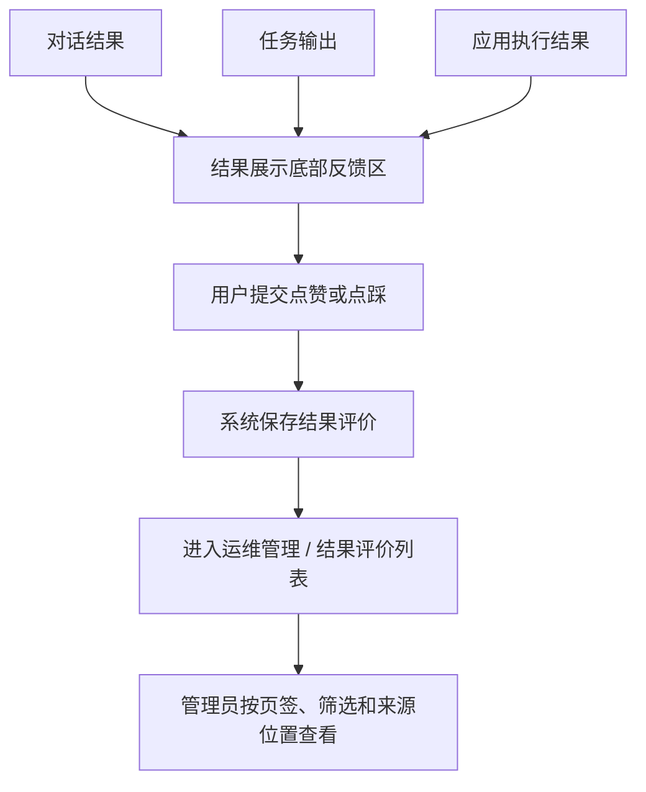
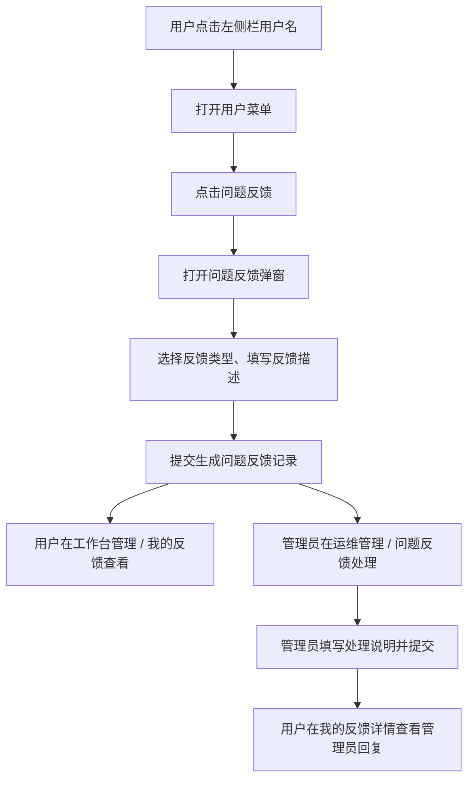

# 结果评价与问题反馈

**产品**：综合分析平台  
**状态**：待开发  
**更新**：2026-07-08  
**关联材料**：Paper《点赞、踩、问题反馈》；工作台管理；运维管理

---

## 1. 需求背景

平台需要同时收集两类信号：用户对模型产出结果的轻量质量评价，以及用户对产品功能、数据、权限、体验等问题的主动反馈。本次按两条业务路径拆分：结果评价只沉淀点赞 / 点踩质量信号；问题反馈进入独立反馈列表，由管理员做轻量受理和回复。

---

## 2. 目标场景

用户查看完成后的结果内容时，可以在结果展示底部点赞或点踩；点踩时可补充问题类型和描述。用户也可以从左侧栏用户菜单提交产品级问题反馈，并在工作台管理中查看自己的反馈状态和管理员回复。管理员在运维管理中分别查看结果评价和问题反馈。

---

## 3. 本次做什么

### 3.1 结果评价

| 对象 | 规则 |
| --- | --- |
| 入口 | 对话结果、任务输出、应用执行结果的结果展示底部轻量反馈区，只展示点赞、点踩 |
| 点赞 | 点击后直接保存，不打开弹窗 |
| 点踩 | 打开“结果评价”弹窗，可提交问题类型和问题描述；跳过时只保存点踩 |
| 问题类型 | 不正确或不完整、没有遵循我的指示、偏题 / 超出范围、丢失上下文、速度慢或有故障、其他 |
| 管理列表 | 运维管理 / 结果评价，页签为全部、点踩、点赞，展示统计数量 |
| 列表字段 | 类型、提交人、提交时间、问题类型、问题描述、来源位置 |
| 来源位置 | 展示工作台路径，支持点击跳转到对应工作台上下文 |

说明：点赞和点踩统一叫结果评价；结果评价不进入问题反馈列表，不提供处理动作；点踩弹窗不提供单独附件上传入口。

### 3.2 问题反馈

| 对象 | 规则 |
| --- | --- |
| 入口 | 左侧栏底部用户名菜单中的“问题反馈” |
| 提交弹窗 | 选择反馈类型，填写反馈描述；描述可直接粘贴截图 |
| 反馈类型 | 功能异常或缺失、操作体验问题、权限或配置问题、数据或文件问题、性能与稳定性、其他问题 |
| 我的反馈 | 工作台管理中展示用户自己的反馈；页签为全部、待受理、已受理 |
| 我的反馈列表 | 状态、提交时间、问题类型、反馈内容、附件、操作 |
| 我的反馈详情 | 展示提交人、提交时间、状态、问题类型、问题描述、附件、管理员回复；附件以可点击文件名展示 |
| 管理列表 | 运维管理 / 问题反馈；页签为全部、待反馈、已反馈 |
| 管理列表字段 | 状态、提交人、提交时间、问题类型、反馈内容、操作，不展示附件列 |
| 管理处理 | 待反馈为“处理”，已反馈为“查看”；管理员提交处理说明后，用户可在“我的反馈”查看 |

说明：问题反馈不放在对话回答块或结果文件末尾；问题反馈和结果评价不共用列表、状态和处理动作。

### 3.3 公共入口和模块归属

| 对象 | 规则 |
| --- | --- |
| 用户信息区 | 左侧栏底部展示用户头像和用户名，右侧展示设置图标按钮 |
| 用户菜单 | 点击用户名后展示个人中心、问题反馈、关于、退出登录 |
| 工作台管理 | 点击设置图标进入，侧边栏包含“我的反馈” |
| 运维管理 | 系统管理侧新增一级模块，包含信息统计、问题反馈、结果评价 |

---

## 4. 本次不做什么

1. 不在对话回答块或结果文件末尾放问题反馈按钮。
2. 不把点踩自动转成问题反馈。
3. 不做多轮反馈沟通、处理人指派、SLA、催办和复杂工单闭环。
4. 不做结果评价的处理状态。
5. 不做面向普通用户的全量反馈管理页。
6. 不把问题反馈或结果评价自动用于模型训练。

---

## 5. 验收口径

1. 结果评价和问题反馈按两条业务路径分别展示主线流程图和规则说明。
2. 对话结果、任务输出、应用执行结果底部只展示点赞、点踩；不展示问题反馈入口。
3. 点赞点击后直接保存；点踩打开“结果评价”弹窗，支持提交或跳过。
4. 点踩弹窗展示 6 个问题类型，不提供单独附件上传入口。
5. 用户可从左侧栏用户名菜单进入“问题反馈”弹窗，并提交 6 类产品级反馈。
6. 工作台管理 / 我的反馈只展示当前用户自己的反馈，详情中可查看附件和管理员回复。
7. 运维管理 / 问题反馈列表不展示附件列，管理员可填写处理说明并提交。
8. 运维管理 / 结果评价列表展示全部、点踩、点赞页签，来源位置可跳转到对应工作台上下文。
