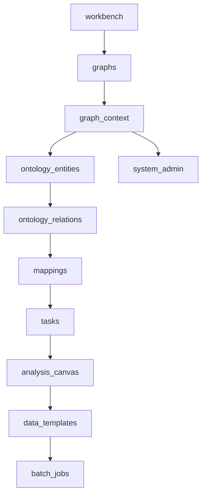

# 数据图谱平台 v1.0：页面交互重构骨架（初稿）

> 目的：为后续“页面交互重构 / 生成初步页面骨架”提供可直接落地的页面地图、页面区块骨架、关键交互流与状态骨架。
>
> 主要依据：用户操作手册（2026-04-16）；参考校准：PRD（MindJunc Graph，v1.0，2025-07-03）。

---

## 1. 全局页面地图（模块分组）

### 1.1 一级模块定义（最终口径）

- **工作台**：平台全局态势与快捷入口
- **图查询**：以图谱分析画布为核心的查询、探索、分析、模板与批量能力
- **图管理**：图谱创建维护、本体建模、数据接入与任务调度
- **系统管理**：用户、角色权限、审计日志、系统参数等平台级治理

> 说明：本稿后续章节统一按以上 4 个一级模块组织，避免“后台管理/智能图析”与“图查询/图管理”两套口径并存。

### 1.2 页面树（L1/L2）

- **工作台**
  - 工作台（平台概览）
- **图管理**
  - 图谱管理
  - 图谱列表（卡片/列表）
  - 新建图谱（弹窗）
  - 导入图谱（弹窗）
  - 图谱详情入口（进入某图谱的上下文）
  - 图谱权限管理（对图谱授权）
  - 图谱导出/清除数据/删除（高风险操作）
  - 本体建模
  - 实体类型管理（列表 + 编辑器）
  - 关系类型管理（列表 + 编辑器）
  - 本体拓扑预览（预览图/画布）
  - 数据接入
  - 数据源管理（数据表/数据源列表）
  - 映射规则管理
    - 实体映射规则（新增/维护）
    - 关系映射规则（新增/维护）
  - 任务管理（执行记录/详情）
  - 调度管理（若与任务管理拆分）
- **图查询**
  - 图谱分析
  - 图谱分析首页（选择图谱/进入画布）
  - 图谱探查（主画布）
  - 节点/边详情（侧栏/弹窗）
  - 拓展节点（操作面板）
  - 隐藏/删除节点（画布操作）
  - 节点布局（布局切换）
  - 图上分析（圈选/路径/邻居/统计等入口）
  - 工具栏（缩放/重置/导出/截图/设置等）
  - 数据模板（查询方法管理）
  - 推理模板（推理规则/算法模板管理）
  - 批量任务（跑批执行/历史/详情）
- **系统管理**
  - 用户/组织/权限（PRD口径）
  - 实体类型库/关系类型库（PRD口径，如存在）
  - 参数配置/日志/审计（PRD口径，如存在）

---

## 2. 页面交互骨架明细（页面 -> 区块 -> 关键交互）

> 统一骨架术语：**顶部区**（全局导航/面包屑/图谱选择器）｜**筛选区**｜**主工作区**（列表/画布/表单）｜**详情侧栏**｜**底部操作区**（主按钮/次按钮）｜**反馈层**（消息/抽屉/弹窗）。

### 2.1 工作台（平台概览）

- **路由草案**：`/workbench`
- **页面目标**：提供全平台运行状态宏观视图 + 快速入口
- **区块骨架**
  - 顶部区：全局导航（入口模块）
  - 主工作区：
    - 数据统计区（图谱数、节点数、关系数、数据源数）
    - 数据可视化区（分布图、趋势图）
  - 快捷入口：跳转图谱管理/最近访问图谱
- **关键交互流**
  - 进入工作台 → 查看指标/趋势 → 跳转到图谱管理或指定图谱
- **状态骨架**
  - 加载态：骨架屏/占位图
  - 空态：无图谱/无数据源（引导“新建图谱/导入图谱/接入数据”）

---

## 3. 图管理：图谱管理（创建与维护）

### 3.1 图谱列表（卡片/列表）

- **路由草案**：`/graphs`
- **页面目标**：管理图谱项目、进入图谱上下文
- **区块骨架**
  - 顶部区：标题 + 新建/导入按钮
  - 筛选区：搜索（名称/路径/创建人/状态）
  - 主工作区：图谱卡片/列表（基础信息 + 快捷操作）
  - 反馈层：刷新/加载/错误
- **关键交互流**
  - 新建图谱 → 弹窗填写 → 创建成功 → 列表出现新卡片
  - 导入图谱 → 选择 JSON 文件 → 导入成功 → 刷新可见
  - 点击图谱卡片 → 进入该图谱默认页（建议：图谱分析或图谱概览）
  - 卡片快捷操作：查看统计/编辑/权限管理/导出/清除数据/删除
- **状态骨架**
  - 空态：无图谱（引导新建/导入）
  - 加载态：列表加载、操作按钮 loading
  - 失败态：创建/导入/删除失败（给出原因 + 重试）

### 3.2 新建图谱（弹窗）

- **路由草案**：`/graphs`（弹窗态）
- **页面目标**：创建一个可配置的图谱空间
- **区块骨架**：表单（图谱路径/名称、描述）
- **关键交互流**
  - 打开弹窗 → 校验必填 → 提交 → 成功关闭并刷新
- **状态骨架**
  - 校验态：必填缺失/重复名称/路径格式

### 3.3 导入图谱（弹窗）

- **路由草案**：`/graphs`（弹窗态）
- **区块骨架**：表单（图谱名称、选择 JSON 文件、导入进度）
- **关键交互流**
  - 选择文件 → 点击导入 → 展示进度/结果 → 成功后刷新列表
- **状态骨架**
  - 加载态：导入中（进度/阻止重复）
  - 失败态：格式错误/解析失败/权限不足

### 3.4 图谱卡片“进入图谱上下文”

- **路由草案**：`/g/:graphId/*`
- **页面目标**：所有“本体建模/数据接入/分析”均需在某图谱上下文内运行
- **区块骨架**
  - 顶部区：图谱选择器（当前图谱名称、切换图谱）
  - 侧边/顶部导航：本体建模 / 数据接入 / 任务&调度 / 图谱分析
- **关键交互流**
  - 进入某图谱 → 默认落在“图谱分析”或“图谱概览”
  - 切换图谱 → 保持在同模块（如仍在本体建模）并刷新数据
- **状态骨架**
  - 权限受限态：无该图谱权限（提示申请/返回列表）

---

## 4. 图管理：本体建模（定义图谱结构）

### 4.1 实体类型管理

- **路由草案**：`/g/:graphId/ontology/entities`
- **页面目标**：定义“实体类型/属性/索引/显示名/链接配置”
- **区块骨架**
  - 顶部区：新增实体类型按钮、搜索
  - 主工作区：实体类型列表（可展开属性）
  - 详情侧栏/弹窗：实体类型编辑（表单模式/SQL模式）
- **关键交互流**
  - 新增实体类型 → 配置名称/描述/属性 → 选择显示名字段 → 可选索引/重建索引 → 保存
  - 列表展开/收起属性 → 快捷重建索引
  - 编辑/清空数据/删除（带二次确认）
- **状态骨架**
  - 空态：无实体类型（引导新增）
  - 校验态：名称必填/重复、属性类型不合法

### 4.2 关系类型管理

- **路由草案**：`/g/:graphId/ontology/relations`
- **页面目标**：定义“关系类型/属性/默认显示字段/实体映射/链接配置”
- **区块骨架**
  - 主工作区：关系类型列表（可展开属性 + 实体映射）
  - 详情侧栏/弹窗：关系类型编辑器
- **关键交互流**
  - 新建关系类型 → 配置源实体/目标实体/方向 → 属性/索引 → 保存
  - 编辑/清空数据/删除（高风险确认）
- **状态骨架**
  - 前置约束态：实体类型不足时提示先建实体类型

### 4.3 本体拓扑预览

- **路由草案**：`/g/:graphId/ontology/topology`
- **页面目标**：可视化预览本体结构（实体-关系网络）
- **区块骨架**
  - 主工作区：拓扑画布
  - 工具栏：缩放、布局、筛选
  - 详情侧栏：节点/边信息
- **关键交互流**
  - 点击实体/关系 → 查看详情 → 快速跳转到对应管理页
- **状态骨架**
  - 空态：本体未定义

---

## 5. 图管理：数据接入（导入图谱数据）

### 5.1 数据源管理

- **路由草案**：`/g/:graphId/ingestion/sources`
- **页面目标**：管理接入的结构化数据表/数据源
- **区块骨架**
  - 顶部区：导入/刷新/搜索
  - 主工作区：数据表列表（表名、来源、字段数、导入时间等）
  - 反馈层：删除确认/错误提示
- **关键交互流**
  - 导入数据源 → 形成可选数据表
  - 删除数据表 → 若被映射引用则阻止并提示依赖
- **状态骨架**
  - 空态：无数据源（引导先接入）

### 5.2 映射规则管理（实体/关系）

- **路由草案**：`/g/:graphId/ingestion/mappings`
- **页面目标**：将数据字段映射到本体结构（含 ID 规则）
- **区块骨架**
  - 左侧：本体结构（实体类型/关系类型树）
  - 中间：数据源表与字段
  - 右侧：映射配置面板（字段映射、转换规则、ID字段）
  - 底部：保存/校验/发布（若有）
- **关键交互流（实体映射）**
  - 选择实体类型 → 选择数据表 → 拖拽字段到属性 → 指定唯一标识 ID → 保存
- **关键交互流（关系映射）**
  - 选择关系类型 → 选择关联表 → 映射关系属性 → 指定起点/终点实体 ID 字段 → 保存
- **状态骨架**
  - 校验态：缺少 ID 映射/字段类型不兼容/引用不存在实体
  - 失败态：保存失败（保留草稿、可重试）

### 5.3 任务管理（执行/历史/详情）

- **路由草案**：`/g/:graphId/ingestion/tasks`
- **页面目标**：监控接入任务执行历史与结果，支持手动触发
- **区块骨架**
  - 顶部区：新建/立即执行、筛选（状态/时间/触发类型）
  - 主工作区：任务列表（开始/结束/状态/导入量/耗时）
  - 详情页/抽屉：任务详情（日志、错误、映射快照）
- **关键交互流**
  - 立即执行 → 选择范围（全量/增量/选择映射项）→ 运行中 → 成功/失败
  - 查看任务详情 → 定位失败原因 → 关联跳转到映射规则
- **状态骨架**
  - 运行态：实时刷新/轮询
  - 失败态：错误摘要 + 完整日志入口

### 5.4 调度管理（如拆分）

- **路由草案**：`/g/:graphId/ingestion/schedules`
- **页面目标**：配置周期调度与开关
- **区块骨架**
  - 表单：周期（天/周/月）、执行时间、开关
  - 反馈层：保存成功提示
- **关键交互流**
  - 配置周期 → 开启调度 → 后续周期自动触发
  - 关闭调度 → 停止自动触发
- **状态骨架**
  - 风险提示：开启/变更影响范围说明

---

## 6. 图查询：图谱分析（核心交互画布）

> 本模块是“交互重构”的关键：建议以“画布 + 侧栏 + 工具栏 + 查询/模板面板”的骨架统一承载后续能力扩展。

### 6.1 图谱分析首页 / 进入画布

- **路由草案**：`/g/:graphId/analysis`
- **页面目标**：进入图谱探索，提供初始查询方式（从模板/从实体/从最近会话）
- **区块骨架**
  - 顶部区：图谱切换、全局搜索入口
  - 主工作区：画布（初始为空或默认中心节点）
  - 侧栏：模板/查询构建器/历史会话
- **关键交互流**
  - 选择模板 → 生成查询 → 在画布渲染
  - 从全局搜索选择实体 → 定位到画布中心
- **状态骨架**
  - 空态：未加载任何节点（引导选择模板/搜索实体）

### 6.2 图谱探查（主画布）

- **路由草案**：`/g/:graphId/analysis/explore`
- **页面目标**：在图上完成“查、看、拓、筛、算、导”
- **区块骨架**
  - 工具栏：缩放/重置/布局/导出/截图/设置
  - 画布：节点与边
  - 详情侧栏：节点/边详情、关联操作
  - 底部/浮层：快捷操作条（拓展、隐藏、删除、分析）
- **关键交互流（手册覆盖）**
  - 点击节点/边 → 右侧展示详情
  - 拓展节点 → 选择拓展方式/层级/关系 → 渲染新增节点
  - 隐藏节点 → 从画布隐藏（可撤销）
  - 删除节点 → 二次确认（影响范围提示）
  - 节点布局 → 切换布局策略（力导向/层次/环形等）
  - 图上分析 → 触发路径/邻居/统计/图计算等能力入口
- **状态骨架**
  - 加载态：查询执行中（画布占位、侧栏可取消）
  - 失败态：查询失败（保留当前画布、可重试）
  - 撤销态：隐藏/删除支持撤销（短时）

### 6.3 数据模板（查询方法管理）

- **路由草案**：`/g/:graphId/analysis/templates/data`
- **页面目标**：沉淀可复用查询模板（供画布/跑批使用）
- **区块骨架**
  - 左侧：模板列表（分组/搜索）
  - 右侧：模板编辑区（参数/查询语句/预览）
  - 底部：保存/发布/运行
- **关键交互流**
  - 新建模板 → 配置参数 → 运行预览 → 保存/发布
- **状态骨架**
  - 草稿态：未发布
  - 失败态：运行失败（错误定位）

### 6.4 推理模板

- **路由草案**：`/g/:graphId/analysis/templates/reasoning`
- **页面目标**：定义推理规则/算法模板并可在图谱上执行
- **区块骨架**：模板列表 + 编辑器 + 运行预览/影响范围
- **关键交互流**
  - 新建推理模板 → 校验 → 试运行 → 保存/发布
- **状态骨架**
  - 风险提示：推理写回数据与否（如有）需显式选择

### 6.5 批量任务（跑批）

- **路由草案**：`/g/:graphId/analysis/batch`
- **页面目标**：基于同一查询方法批量运行并导出结果
- **区块骨架**
  - 顶部区：选择模板、输入批量参数（文件/列表）
  - 主工作区：跑批任务列表（状态/进度/结果）
  - 详情抽屉：单次运行明细、失败原因
- **关键交互流**
  - 选择数据模板 → 上传参数 → 提交跑批 → 查看进度 → 导出结果
- **状态骨架**
  - 运行态：进度条/预计耗时
  - 失败态：部分失败可重试

---

## 7. 系统管理（平台级）

- **路由草案**：`/admin/*`
- **页面目标**：账号/组织/权限/审计等平台级配置
- **区块骨架**
  - 左侧菜单：用户、角色/权限、组织、日志/审计、参数配置
  - 主工作区：列表 + 新增/编辑弹窗
- **关键交互流**
  - 权限配置 → 影响到图谱列表/图谱上下文访问
- **状态骨架**
  - 权限受限态：仅管理员可见

---

## 8. 页面状态骨架（统一规范）

> 建议重构时先落“统一状态组件/交互规范”，减少页面间不一致。

- **空态**
  - 无图谱：引导“新建/导入”
  - 无本体：引导“创建实体/关系类型”
  - 无数据源：引导“接入数据源”
  - 无查询结果：引导“调整条件/检查映射与任务”
- **加载态**
  - 列表加载：骨架屏 + 分页占位
  - 提交类操作：按钮 loading + 禁用重复提交
  - 画布查询：画布遮罩 + 可取消
- **成功态**
  - 轻提示：消息 toast
  - 影响范围大：弹窗说明变更已生效，提供“查看详情”
- **失败态**
  - 失败原因可读（权限/校验/网络/后端错误）
  - 保留用户输入/草稿，支持重试
- **权限受限态**
  - 明确“无权限的对象范围”（图谱/模块/操作）
  - 提供返回入口（回列表/申请权限）

---

## 9. 路由草案与页面跳转关系

### 9.1 路由草案（建议）

> 规则：平台级 `/`；图谱上下文统一 `/g/:graphId/*`；避免跨页面携带隐式状态。

- `/workbench`
- `/graphs`
- `/g/:graphId/ontology/entities`
- `/g/:graphId/ontology/relations`
- `/g/:graphId/ontology/topology`
- `/g/:graphId/ingestion/sources`
- `/g/:graphId/ingestion/mappings`
- `/g/:graphId/ingestion/tasks`
- `/g/:graphId/ingestion/schedules`（可选）
- `/g/:graphId/analysis`
- `/g/:graphId/analysis/explore`
- `/g/:graphId/analysis/templates/data`
- `/g/:graphId/analysis/templates/reasoning`
- `/g/:graphId/analysis/batch`
- `/admin/users`、`/admin/roles`、`/admin/audit`（示例）

### 9.2 跳转关系（主链路）

---

## 10. 交互重构优先级（建议）

### P0（先做：打通图管理+图查询主链路）

- 图管理：图谱列表 + 进入图谱上下文（`/graphs`、`/g/:graphId/*`）
- 图管理：本体建模（`/g/:graphId/ontology/*`）
- 图管理：数据接入（`/g/:graphId/ingestion/mappings`、`/g/:graphId/ingestion/tasks`）
- 图查询：图谱探查主画布（`/g/:graphId/analysis/explore`）
- 工作台：全局概览入口（`/workbench`）

### P1（增强：扩展主链路）

- 调度管理（若确需拆分）

### P2（扩展：沉淀与规模化）

- 数据模板/推理模板
- 批量任务跑批
- 系统管理增强（审计/日志等）

---

## 11. 待确认项（用于后续评审）

1. **图谱卡片点击默认落点**：进入“图谱分析”还是“图谱概览/本体建模”？（影响主链路节奏）
2. **任务管理 vs 调度管理**：是否拆成两个页面，还是在同页 Tab 化？
3. **智能图析能力边界**：PRD的“添加实体/拓展关系/筛选实体/查找路径/共同邻居/统计分析/图计算”是否都纳入同一画布页的工具面板？
4. **高风险操作一致性**：清除数据/删除图谱/清空实体类型数据/删除关系类型是否统一“风险确认”规范（影响交互一致性）。

