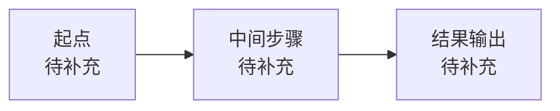

# 业务流程

> 本产品单元当前为 **placeholder** 状态，以下条目待后续补充。

## 1. 主流程总览

## 2. 每一步在解决什么问题

### 2.1 步骤 A

- 做什么：待补充。
- 输入：待补充。
- 输出：待补充。
- 人工介入点：待补充。

### 2.2 步骤 B

- 做什么：待补充。
- 输入：待补充。
- 输出：待补充。
- 人工介入点：待补充。

（可根据实际流程增删步骤。）

## 3. 关键原则

1. 待补充。
2. 待补充。

## 4. 当前范围内与范围外

- **范围内能力**：待补充。
- **范围外或弱化能力**：待补充。

## 5. 一句话理解主流程

- 待补充。
