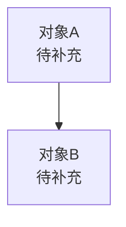

# 基本概念

> 本产品单元当前为 **placeholder** 状态，以下条目待后续补充。

## 1. 概念命名原则

- 核心概念只使用一个正式名称；不同概念不共用同一名称；历史别名在定义处注明并标记已弃用。（与产品线其他单元保持一致。）

## 2. 统一术语

| 术语 | 定义 | 易混淆项 | 统一口径 |
|------|------|----------|----------|
| 数据漫游 | 待补充 | 待补充 | 待补充 |

## 3. 核心对象

对每个核心对象需回答：它是什么、解决什么问题、与其他对象的关系。

### 3.1 对象 A

- 它是什么：待补充。
- 它解决什么问题：待补充。
- 它包含什么 / 与其他对象关系：待补充。

### 3.2 对象 B

- 它是什么：待补充。
- 它解决什么问题：待补充。
- 它包含什么 / 与其他对象关系：待补充。

（可根据实际对象数量增删小节。）

## 4. 对象关系

## 5. 状态定义

| 状态 | 含义 | 谁可以改变它 |
|------|------|--------------|
| 待补充 | 待补充 | 待补充 |

## 6. 易混淆提醒

1. 数据漫游的核心对象与边界：待补充。
2. 与自动化审计等产品单元的术语是否共享口径：待补充。
